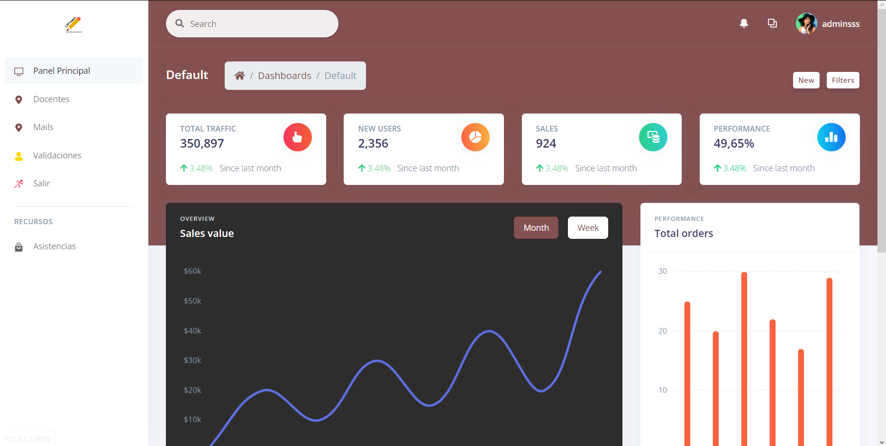
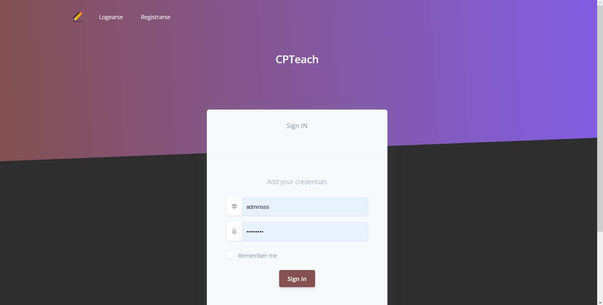

# Proyecto final de IS-III - CPTeach

## Trello

 [Enlace](https://trello.com/invite/b/NZPuDOC3/ATTI1e61b3589a3578735cd3740d8cd08937926EEC0C/cpteach-dev-progress)

<p align="center">
  
</p>

## Integrantes 
- Alvaro Sergio Cano Luque
- Angie Alexandra Pino Huarsaya
- Fabrizio Miguel Mattos Cahui 
- Gleddynuri Marbel Picha Chañi 
- Joao Franco Emanuel Chávez Salas
- Diego Josue Aquino Quipe
## Contexto
Siempre a comienzos del semestre existen problemas con la asignación de docentes y también para aprender los cursos debidamente, no solo en la universidad sino en el campo educativo, después de la pandemia del 2019 se ha incrementado los problemas de déficit de atención en los estudiantes.
Nuestra preocupacion de esta problematica es grave, porque en la universidad se están perdiendo semanas de clases y para cuando llegue el docente ya no se puede recuperar el tiempo perdido pero de haber usado la aplicación ya se habría avanzado parte del temario del curso y no habría problemas para el examen, desde el punto de vista de los estudiantes este problema se podría resolver con la tecnología que tanto estamos aprendiendo.


## ¿Qué es CPTeach?
CPTeach es una plataforma de administracion y contratacion de docentes, primariamente para el lado universitario. En la cual se recibiran correos con informacion personal en documentos de cada docente el cual desee unirse a la institucion. Ademas de un perfil propio donde se vera salarios, cursos impartidos, tiempo en la institucion, termino de contrato, etc.

## Objetivos

### Objetivo General
Renovar completamente el proceso de eleccion de docentes en la universidad, ademas de poder modularizar el sistema para darle otros usos educativos, como el de admistracion de docentes en general.
### Objetivos Específicos
* *Implementar el uso de automatizacion a la hora de validar titulos profesionales.*
* *Integrar plataformas móviles con plataformas web*
* *Poner en funcionamiento bases de datos y servidores que funcione conjuntamente con la aplicación.*
* *Estudiar el desarrollo de aplicaciones Android y aplicaciones web.*
* *Disminuir la carga laboral del personal docente y administrativo.*
* *Mejorar la administracion y eleccion de docentes*

## Propuesta
Nos proponemos crear una plataforma en donde podamos captar docentes para el dictado de cursos de la carrera, que sigan un proceso de selección y una vez contratados, poder asignarlos a diversos cursos de la carrera. adicionalmente captaremos a docentes que podrán dar sesiones especiales de 1 o 2 horas para reforzar los conocimientos de los alumnos según sea requerido por ellos.
Es posible que se llegue a comercializar porque a pesar de que existen plataformas similares, ésta aplicaría para cursos universitarios en donde hasta ahora no existe una forma de conseguir a un docente por horas adicionales para el reforzamiento del curso según la disposición de tiempo de los estudiantes, ni docentes que puedan cubrirse unos a otros para que se respete el cronograma de clases.
Según los porcentajes en cuanto educación, desde el nivel  inicial hasta el superior, hace falta docentes que refuercen el conocimiento en el nivel primario y superior.
Por lo tanto la razón de la comercialización esta en el porcentaje de estudiantes que no pueden culminar sus estudios universitarios, ya sea por trabajo, problemas familiares entre otros.


## Beneficios
* **Ahorrar tiempo**: Con nuestro sistema tendremos un único punto de referencia para la contratacion de docentes, ademas de poder ser de un lugar administrativo para docentes y secretaria.
* **Aumentar la precisión:** Con el sistema se reduce drásticamente el error humano al revisar documentos ademas de agilizar el proceso de administracion de docentes.
* **Garantizar la integridad de los datos:** En comparación con el antiguo papeleo a la hora de una contratacion y tiempo adicional innecesario, nuestro sistema podra brindar una mayor agilidad a la administracion de la institucion a la cual se le imparta nuestro servicio.
* **Reducir el trabajo administrativo:** La documentacion estara disponible al instante.
* **Disminuir los costes administrativos:** Al poder centralizar diversos sistemas en uno, logramos reducir costos en un alto porcentaje.

## Impacto Social
La iniciativa tiene repercusiones positivas para:
**Estudiantes:** Reducción del el absentismo, mejorar la calidad de las clases impartidas asi generando mejores bases para nuestros futuros profesionales.
**Docentes:** La contratacion es rapida, ademas de evitar perdida de datos.
**Dirección de las Escuelas y Facultades:** El equipo directivo evita mareos a la hora de administrar docentes, al dar notificaciones sobre puntos importantes a la hora del trabajo.
## Tecnologias
## Diagrama de Clases

<p align="center">
  
</p>

## Diagrama entidad relación

<p align="center">
  
</p>

## Diagrama de Casos de Uso


## Wireframes
Para las diagramamaciones de las se utilizó Figma

**Link APP:** -  [Versión App](https://www.figma.com/file/5x7CzySBo0gkk9dtewyFwO/Untitled?type=design&node-id=0%3A1&t=IWCB6xXtNfGSOUUi-1)
**Link WEB** - [Versión Web](https://www.figma.com/file/5x7CzySBo0gkk9dtewyFwO/Untitled?type=design&t=GCXpUJp5qlITTBsL-1)

## Capturas

<p align="center">
  
</p>
<p align="center">
  
</p>


## Funcionalidades

 - [X] Iniciar sesión.
 - [X] Cerrar sesión.
 - [X] Asignar curso a docente.
 - [X] Ver estadísticas de rendimiento de docente (asistencias, faltas, etc).
 - [X] Generar reportes.
 - [X] Editar perfil de docente.
 - [X] Despedir docente.
 - [X] Editar horario.
 - [X] Ver cursos.
 - [X] Ver horarios.
 - [X] Ver salarios.
 - [X] Ver fecha de contratacion/fin de contratacion.
## MVC-Modelo Vista Controlador
<p align="center">
  
</p>

## Requisitos funcionales
Registro y proceso de selección:
- [X] Los docentes deben poder registrarse en la plataforma proporcionando información personal y académica relevante.
- [X] Se debe realizar un proceso de selección para contratar a los docentes, con etapas de evaluación y aprobación.
Gestión de la plana docente:
- [X] El sistema debe permitir asignar a los docentes contratados a los respectivos cursos y asignaturas.
- [X] Los docentes deben poder acceder a su cronograma de clases, que muestre la fecha, hora y lugar de cada sesión.
Personalización de criterios de evaluación:
- [X] Los docentes deben tener la capacidad de personalizar los criterios y pesos de evaluación para cada curso que imparten.
- [X] Deben poder definir los diferentes componentes de evaluación, como exámenes, trabajos, participación, etc.
 Registro y actualización de notas:
- [X] Los docentes deben poder ingresar y actualizar las notas de los alumnos matriculados en sus cursos.
- [X] El sistema debe permitir el registro de notas de forma fácil y precisa, y realizar cálculos automáticos de promedios y calificaciones finales.
 
 
## REquisitos no funcionales
 Seguridad:
- [X] La plataforma debe garantizar la seguridad de los datos personales y académicos de los docentes y alumnos.
- [X] Se deben implementar medidas de autenticación y autorización para proteger la información sensible.
- [X] Las funciones de colaboración deben cumplir con los estándares de seguridad de la universidad para proteger la confidencialidad y privacidad de los datos compartidos.
Usabilidad:
- [X] La interfaz de usuario debe ser intuitiva y fácil de usar para docentes y alumnos.
- [X] Se debe proporcionar una navegación clara y estructurada, con instrucciones claras para cada funcionalidad.
Escalabilidad:
- [X] El sistema debe ser capaz de manejar un gran número de docentes y alumnos a medida que la universidad crece.
- [X] Debe tener capacidad para manejar un alto volumen de datos, como registros de notas y mensajes.
Rendimiento:
- [X] La plataforma debe tener un rendimiento óptimo, con tiempos de carga rápidos y respuestas ágiles a las solicitudes de los usuarios.
- [X] Debe ser capaz de manejar múltiples usuarios simultáneamente sin afectar la velocidad y la calidad del servicio.
Mantenibilidad:
- [X] El código y la infraestructura de la plataforma deben ser mantenibles y permitir futuras actualizaciones y mejoras.
- [X] Se debe proporcionar documentación adecuada para facilitar el mantenimiento y la resolución de problemas.

## 📝 Para inicializar el proyecto WEB
Ejecute primero los siguientes comandos en la direccion del proyecto
```
virtualenv env
.\Scripts\activate
```
Instalar modulos - SQLite
```
pip install -r requirements.txt
```
Crear Tablas
```
python manage.py makemigrations
$ python manage.py migrate
```
Iniciar la aplicacion
```
python manage.py runserver # default port 8000
```
Iniciar la aplicacion (Puerto modificado)
```
python manage.py runserver 0.0.0.0:<your_port>
```


## Resumen de conceptos utilizados

#### CODIFICACIÓN LEGIBLE (CLEAN CODE)

- Comentarios
- Reglas de nombres
- Consejos de comprensibilidad
- Reglas de funciones
- Objetos y estructuras de datos
- Captalize SQL Special Words


#### PRINCIPIOS SOLID

- Principio de inversión de dependencia (DIP)
- Principio abierto/cerrado (OCP)
- Interface segregation principle(ISP)
- Liskov Substitution Principle (LSP)

#### PRINCIPIOS DE DDD
 - Ubiquitous Lenguage
 - Persistance Ignorance
 - Services

# Conceptos Utilizados

## ESTILOS DE LA PROGRAMACIÓN
- Letterbox
- Tantrum
- Aspects
- Persistent Tables
- Declared Intentions
- Things

